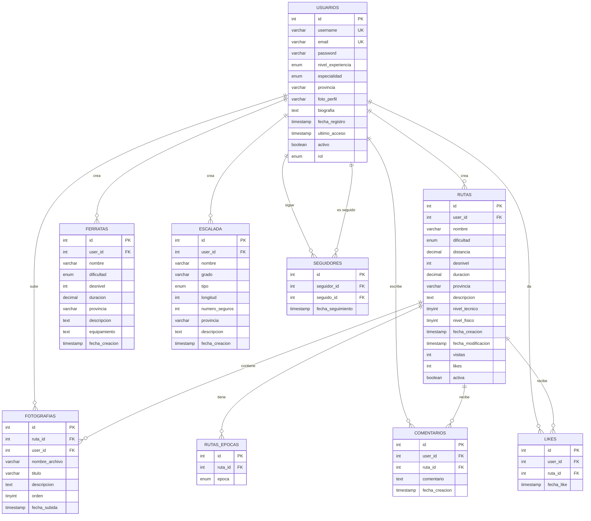

# PROYECTO PHP - FASE 2
## Integración con Bases de Datos y Refactorización a POO

---

## 3. INTEGRACIÓN CON BASES DE DATOS MYSQL

### 3.1 Objetivos Específicos de la Unidad

- Diseñar y crear bases de datos relacionales normalizadas
- Conectar PHP con MySQL utilizando MySQLi
- Implementar operaciones CRUD completas con base de datos
- Migrar el sistema de autenticación a base de datos
- Aplicar consultas preparadas para prevenir SQL Injection
- Gestionar relaciones entre tablas (claves foráneas)
- Implementar transacciones para operaciones complejas
- Crear un sistema de paginación para listados
- Desarrollar búsquedas y filtros avanzados

### 3.2 Contenidos Teóricos

#### 3.2.1 Diseño de Bases de Datos Relacionales
- Modelo Entidad-Relación
- Normalización de bases de datos (1FN, 2FN, 3FN)
- Tipos de relaciones (1:1, 1:N, N:M)
- Claves primarias y foráneas
- Índices y optimización de consultas
- Integridad referencial

#### 3.2.2 Conexión PHP-MySQL con MySQLi
- Diferencias entre mysql, mysqli y PDO
- Conexión orientada a objetos vs procedimental
- Gestión de errores de conexión
- Configuración de charset y collation
- Cierre de conexiones y liberación de recursos

#### 3.2.3 Consultas Preparadas (Prepared Statements)
- ¿Qué son y por qué usarlas?
- Sintaxis con MySQLi
- Binding de parámetros (tipos: i, d, s, b)
- Ventajas de seguridad frente a SQL Injection
- Consultas con múltiples parámetros

#### 3.2.4 Operaciones CRUD con MySQLi
- SELECT: consultas simples y complejas
- INSERT: inserción de registros y obtención de ID generado
- UPDATE: actualización de registros
- DELETE: eliminación de registros
- JOIN: consultas entre múltiples tablas
- Funciones de agregación (COUNT, SUM, AVG, MAX, MIN)
- ORDER BY, GROUP BY, HAVING, LIMIT

#### 3.2.5 Gestión de Resultados
- fetch_assoc(), fetch_array(), fetch_object()
- num_rows y affected_rows
- Iteración sobre resultados
- Manejo de resultados vacíos

#### 3.2.6 Transacciones
- Concepto de transacción
- BEGIN, COMMIT, ROLLBACK
- Casos de uso (operaciones múltiples relacionadas)
- Gestión de errores en transacciones

#### 3.2.7 Seguridad en Bases de Datos
- SQL Injection: concepto y prevención
- Validación antes de insertar
- Sanitización vs preparación de consultas
- Hash de contraseñas con password_hash() y password_verify()
- Principio de mínimos privilegios para usuarios de BD

### 3.3 Diagrama Entidad-Relación



### 3.4 Estructura del Proyecto - Fase 2

```
mountain-connect/
│
├── config/
│   ├── database.php          (nuevo: configuración y conexión BD)
│   └── config.php             (constantes generales)
│
├── includes/
│   ├── db_functions.php       (nuevo: funciones auxiliares BD)
│   ├── header.php
│   ├── footer.php
│   ├── auth_check.php
│   └── functions.php
│
├── public/
│   ├── index.php
│   ├── login.php              (actualizar: validación con BD)
│   ├── register.php           (actualizar: insertar en BD)
│   ├── logout.php
│   ├── profile.php            (actualizar: datos desde BD)
│   ├── edit_profile.php       (nuevo)
│   │
│   ├── routes/
│   │   ├── list.php           (actualizar: listar desde BD)
│   │   ├── create.php         (actualizar: insertar en BD)
│   │   ├── view.php           (nuevo: ver detalle ruta)
│   │   ├── edit.php           (actualizar: editar desde BD)
│   │   └── delete.php         (actualizar: eliminar de BD)
│   │
│   ├── ferratas/
│   │   ├── list.php           (nuevo)
│   │   ├── create.php         (nuevo)
│   │   ├── view.php           (nuevo)
│   │   ├── edit.php           (nuevo)
│   │   └── delete.php         (nuevo)
│   │
│   ├── climbing/
│   │   └── (similar a ferratas)
│   │
│   ├── photos/
│   │   ├── upload.php         (nuevo: subir fotos a ruta)
│   │   ├── gallery.php        (nuevo: galería de usuario)
│   │   └── delete.php         (nuevo)
│   │
│   ├── comments/
│   │   ├── add.php            (nuevo)
│   │   └── delete.php         (nuevo)
│   │
│   └── search/
│       └── index.php          (nuevo: búsqueda avanzada)
│
├── sql/
│   ├── create_database.sql    (script proporcionado)
│   └── migrations/            (opcional: para cambios futuros)
│
├── uploads/
│   ├── photos/
│   └── profiles/
│
└── assets/
    ├── css/
    ├── js/
    └── images/
```

### 3.5 Tareas del Proyecto - Fase 2

#### **Tarea 2.1: Configuración de Base de Datos **

**Objetivo:** Crear la base de datos y establecer la conexión desde PHP.

**Funcionalidades:**
- Ejecutar el script SQL proporcionado (`create_DB.sql`) en phpMyAdmin o línea de comandos
- Verificar que todas las tablas se han creado correctamente
- Crear archivo `config/database.php` con:
  - Constantes de configuración (host, usuario, password, nombre BD)
  - Función o clase para establecer conexión MySQLi
  - Gestión de errores de conexión
  - Configuración de charset UTF-8
- Crear archivo `config/config.php` con constantes globales del proyecto
- Probar la conexión creando una página de prueba temporal

**Entregables:**
- Base de datos creada y poblada con datos de ejemplo
- Archivo `database.php` funcional
- Captura de pantalla de la estructura de tablas en phpMyAdmin

---

#### **Tarea 2.2: Migración del Sistema de Registro con Hash de Contraseñas **

**Objetivo:** Adaptar el formulario de registro para guardar usuarios en la base de datos.

**Funcionalidades:**
- Modificar `register.php` para:
  - Mantener todas las validaciones de la Fase 1
  - Verificar que username y email no existan previamente en BD (consulta preparada)
  - Hash de la contraseña usando `password_hash()` con PASSWORD_DEFAULT
  - Insertar nuevo usuario en tabla `usuarios` con consulta preparada
  - Obtener el ID del usuario insertado
  - Mostrar mensaje de éxito y redirección a login
  - Gestión completa de errores de base de datos

**Validaciones adicionales:**
- Username único (consultar BD antes de insertar)
- Email único (consultar BD antes de insertar)
- Mensajes de error específicos si ya existe

**Archivos involucrados:**
- `public/register.php`
- `config/database.php`

---

#### **Tarea 2.3: Migración del Sistema de Login con Verificación de Contraseñas **

**Objetivo:** Implementar autenticación contra la base de datos.

**Funcionalidades:**
- Modificar `login.php` para:
  - Buscar usuario por username o email en BD (consulta preparada)
  - Verificar contraseña con `password_verify()`
  - Crear sesión con datos del usuario (id, username, email, nivel_experiencia)
  - Actualizar campo `ultimo_acceso` del usuario
  - Redirección a página de perfil o página solicitada previamente
  - Gestión de intentos fallidos (mensajes claros sin revelar si existe el usuario)
  
- Modificar `profile.php` para:
  - Cargar todos los datos del usuario desde BD
  - Mostrar información completa del perfil
  - Mostrar foto de perfil si existe
  - Mostrar estadísticas básicas (número de rutas, fotos, etc.)

**Archivos involucrados:**
- `public/login.php`
- `public/profile.php`
- `includes/auth_check.php` (verificar que la sesión tenga ID válido)

---

#### **Tarea 2.4: CRUD Completo de Rutas con Base de Datos **

**Objetivo:** Implementar operaciones completas sobre rutas usando la base de datos.

**Funcionalidades:**

**A) Crear ruta (`routes/create.php`):**
- Mantener formulario de la Fase 1
- Iniciar transacción MySQLi
- Insertar ruta en tabla `rutas` (consulta preparada)
- Obtener ID de ruta insertada
- Insertar épocas seleccionadas en tabla `rutas_epocas`
- Si hay fotos subidas:
  - Procesar cada archivo
  - Insertar registro en tabla `fotografias` por cada foto
- Commit de transacción si todo OK
- Rollback si hay algún error
- Redirección a vista de la ruta creada

**B) Listar rutas (`routes/list.php`):**
- Consulta SELECT con JOIN a usuarios y fotografías
- Mostrar: nombre, dificultad, distancia, desnivel, provincia, autor, miniatura
- Implementar paginación (10-15 rutas por página)
- Implementar filtros opcionales:
  - Por dificultad
  - Por provincia
  - Por nivel técnico/físico
- Ordenación (más recientes, más visitadas, mejor valoradas)
- Enlaces a vista detalle de cada ruta

**C) Ver detalle ruta (`routes/view.php`):**
- Recibir ID por GET
- Consulta preparada para obtener ruta completa
- JOIN con usuario creador
- Cargar épocas recomendadas
- Cargar galería de fotos asociadas
- Incrementar contador de visitas
- Mostrar toda la información de la ruta
- Mostrar comentarios (preparación para Tarea 2.6)
- Botones de editar/eliminar solo si el usuario es el propietario

**D) Editar ruta (`routes/edit.php`):**
- Verificar que el usuario sea el propietario (user_id en sesión == user_id de ruta)
- Cargar datos actuales en formulario
- Procesar actualización con consulta preparada UPDATE
- Gestionar épocas (eliminar las antiguas e insertar las nuevas)
- Permitir añadir nuevas fotos
- Actualizar campo `fecha_modificacion`

**E) Eliminar ruta (`routes/delete.php`):**
- Verificar propiedad de la ruta
- Confirmación antes de eliminar
- Eliminar físicamente las fotos asociadas del servidor
- Eliminar registro de BD (CASCADE eliminará fotos, épocas, comentarios)
- Redirección a lista de rutas

**Archivos involucrados:**
- `public/routes/create.php`
- `public/routes/list.php`
- `public/routes/view.php`
- `public/routes/edit.php`
- `public/routes/delete.php`

---

#### **Tarea 2.5: CRUD de Vías Ferratas **

**Objetivo:** Replicar el CRUD de rutas adaptado a ferratas.

**Funcionalidades:**
- Formulario de creación con campos específicos:
  - Nombre, dificultad (K1-K6), desnivel, duración
  - Provincia, descripción, equipamiento necesario
- Listado con filtros por dificultad y provincia
- Vista detalle completa
- Edición (solo propietario)
- Eliminación (solo propietario)
- Todas las operaciones con consultas preparadas

**Archivos involucrados:**
- `public/ferratas/create.php`
- `public/ferratas/list.php`
- `public/ferratas/view.php`
- `public/ferratas/edit.php`
- `public/ferratas/delete.php`

---

#### **Tarea 2.6: Sistema de Comentarios **

**Objetivo:** Permitir comentarios en rutas.

**Funcionalidades:**
- Formulario para añadir comentario en `routes/view.php`
- Validación: usuario logueado y comentario no vacío
- Insertar comentario en tabla `comentarios` (consulta preparada)
- Mostrar lista de comentarios con:
  - Nombre del usuario que comentó
  - Fecha del comentario
  - Texto del comentario
  - Botón eliminar (solo si es el autor del comentario o de la ruta)
- Eliminar comentario con verificación de permisos
- Actualización asíncrona opcional con JavaScript

**Archivos involucrados:**
- `public/comments/add.php`
- `public/comments/delete.php`
- Actualizar `public/routes/view.php`

---

#### **Tarea 2.7: Sistema de Likes/Favoritos **

**Objetivo:** Implementar likes en rutas.

**Funcionalidades:**
- Botón "Me gusta" en vista de ruta y en listado
- Al hacer click:
  - Verificar si ya existe like del usuario para esa ruta
  - Si no existe: insertar en tabla `likes` e incrementar contador en `rutas`
  - Si existe: eliminar de tabla `likes` y decrementar contador
- Mostrar estado del like (activo/inactivo) según usuario actual
- Mostrar número total de likes
- Implementar con AJAX (opcional) o con redirección

**Archivos involucrados:**
- `public/routes/like.php` (nuevo)
- Actualizar `routes/view.php` y `routes/list.php`

---

#### **Tarea 2.8: Búsqueda Avanzada **

**Objetivo:** Implementar sistema de búsqueda con múltiples criterios.

**Funcionalidades:**
- Formulario de búsqueda con campos:
  - Texto libre (buscar en nombre y descripción)
  - Tipo de actividad (rutas, ferratas, escalada)
  - Dificultad
  - Provincia
  - Rango de distancia (desde-hasta)
  - Rango de desnivel (desde-hasta)
  - Nivel técnico/físico
- Construcción dinámica de consulta SQL según campos completados
- Uso de LIKE para búsqueda de texto
- Uso de operadores de comparación para rangos
- Consultas preparadas con número variable de parámetros
- Mostrar resultados con información resumida
- Paginación de resultados

**Archivos involucrados:**
- `public/search/index.php`

---

#### **Tarea 2.9: Edición de Perfil de Usuario **

**Objetivo:** Permitir al usuario actualizar su perfil.

**Funcionalidades:**
- Formulario pre-rellenado con datos actuales del usuario
- Campos editables:
  - Biografía
  - Nivel de experiencia
  - Especialidad
  - Provincia
  - Foto de perfil (subida nueva o mantener existente)
- Opción de cambiar contraseña (campos: actual, nueva, confirmar nueva)
- Validaciones:
  - Si cambia contraseña: verificar contraseña actual con `password_verify()`
  - Nueva contraseña cumple requisitos
  - Email único si se modifica
- Actualización con consulta preparada UPDATE
- Si se sube nueva foto: eliminar la antigua del servidor
- Actualizar datos en sesión

**Archivos involucrados:**
- `public/edit_profile.php`

---

#### **Tarea 2.10: Panel de Administración - Gestión de Usuarios **

**Objetivo:** Crear funcionalidades básicas de administración.

**Funcionalidades:**
- Crear campo `rol` en tabla usuarios (enum: 'usuario', 'admin')
- Página protegida solo para administradores
- Listar todos los usuarios con:
  - Información básica
  - Número de rutas/ferratas/escaladas creadas
  - Fecha de registro y último acceso
- Acciones de administrador:
  - Activar/desactivar usuario (campo `activo`)
  - Ver perfil completo de cualquier usuario
  - Eliminar usuario (con confirmación)
- Estadísticas generales del sitio:
  - Total de usuarios registrados
  - Total de rutas, ferratas, escaladas
  - Total de fotos
  - Total de comentarios

**Archivos involucrados:**
- Modificar SQL para añadir campo `rol`
- `public/admin/dashboard.php` (nuevo)
- `public/admin/users.php` (nuevo)
- `includes/admin_check.php` (nuevo)

---

### 3.6 Funciones Auxiliares de Base de Datos

**Objetivo:** Crear biblioteca de funciones reutilizables para operaciones comunes.

**Funciones sugeridas en `includes/db_functions.php`:**

- `ejecutarConsulta($conn, $sql, $tipos, $params)` - Ejecutar consulta preparada genérica
- `obtenerRegistro($conn, $tabla, $id)` - Obtener un registro por ID
- `obtenerTodosRegistros($conn, $tabla, $condiciones)` - SELECT genérico
- `insertarRegistro($conn, $tabla, $datos)` - INSERT genérico
- `actualizarRegistro($conn, $tabla, $id, $datos)` - UPDATE genérico
- `eliminarRegistro($conn, $tabla, $id)` - DELETE genérico
- `existeRegistro($conn, $tabla, $campo, $valor)` - Verificar existencia
- `contarRegistros($conn, $tabla, $condiciones)` - COUNT genérico
- `generarPaginacion($total, $porPagina, $paginaActual)` - HTML de paginación
- `escaparHTML($texto)` - Prevenir XSS en salida

---

### 3.7 memoria

**Memoria técnica actualizada que incluya:**
- Descripción de la implementación de cada tarea
- Capturas de pantalla de todas las funcionalidades
- Diagrama Entidad-Relación de la base de datos
- Explicación de decisiones técnicas tomadas
- Problemas encontrados y soluciones aplicadas
- Enlace actualizado al repositorio GitHub con:
  - Código comentado
  - README.md actualizado
  - Script SQL de la base de datos
  - Commits organizados por tareas

---

### 3.8 Consideraciones de Seguridad para la Fase 2

**Imprescindible implementar:**

1. **SQL Injection Prevention:**
   - Uso exclusivo de consultas preparadas (prepared statements)
   - Nunca concatenar variables directamente en SQL
   - Validar tipos de datos antes de consultas

2. **XSS Prevention:**
   - Escapar TODA salida HTML con `htmlspecialchars()`
   - Especial atención en comentarios y descripciones de usuario

3. **Autenticación segura:**
   - Hash de contraseñas con `password_hash()`
   - Verificación con `password_verify()`
   - Nunca almacenar contraseñas en texto plano

4. **Control de acceso:**
   - Verificar permisos en cada operación sensible
   - Comprobar propiedad de recursos antes de editar/eliminar
   - Validar rol de administrador en páginas protegidas

5. **Validación servidor:**
   - Nunca confiar en validaciones del cliente
   - Revalidar todos los datos en servidor
   - Sanitizar entrada antes de procesar

6. **Gestión de archivos:**
   - Validar tipo MIME real del archivo
   - Limitar tamaño de subida
   - Nombres únicos para evitar sobrescritura
   - Almacenar fuera de directorio público si es posible

---

### 3.9 Consejos para el Desarrollo

1. **Desarrollo incremental:** Completar cada tarea antes de pasar a la siguiente
2. **Pruebas constantes:** Probar cada funcionalidad inmediatamente después de implementarla
3. **Commits frecuentes:** Hacer commit después de cada funcionalidad completada
4. **Gestión de errores:** Implementar try-catch y mostrar mensajes útiles al usuario
5. **Código limpio:** Mantener indentación, comentarios y nombres descriptivos
6. **Reutilización:** Usar las funciones auxiliares para evitar duplicación
7. **Backups:** Hacer backup de la base de datos regularmente durante el desarrollo

---

### 3.10 Recursos de Apoyo

- **Documentación oficial MySQLi:** https://www.php.net/manual/es/book.mysqli.php
- **Prepared Statements:** https://www.php.net/manual/es/mysqli.quickstart.prepared-statements.php
- **Password Hashing:** https://www.php.net/manual/es/function.password-hash.php
- **SQL Tutorial:** https://www.w3schools.com/sql/

---


**Modalidad de entrega:** Memoria PDF + Enlace a GitHub + Base de datos exportada (.sql)
