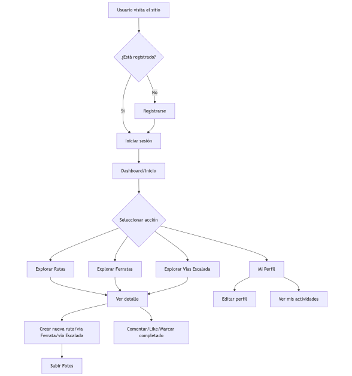
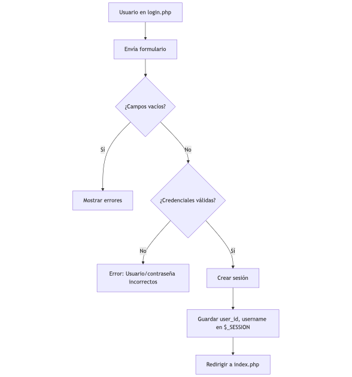
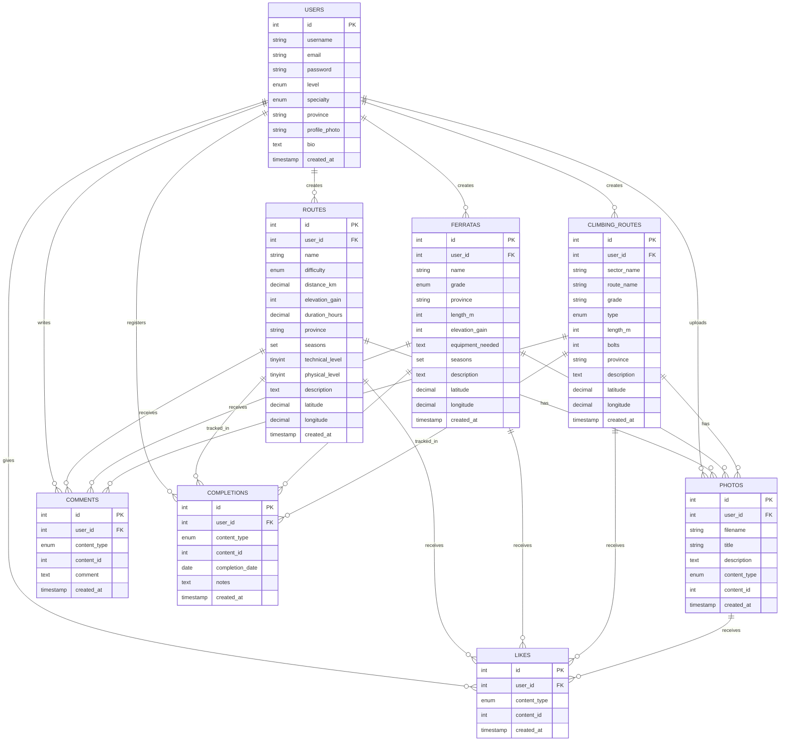
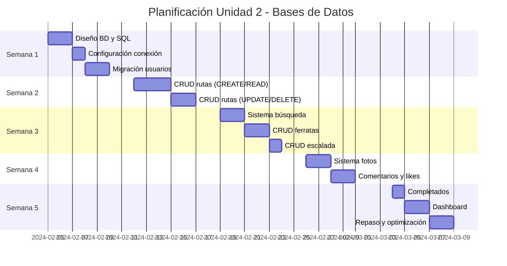

# PROYECTO PHP
## Plataforma Web Montañera con PHP y MySQL

---

## 1. INTRODUCCIÓN DEL PROYECTO

### 1.1 Descripción General
Este proyecto didáctico tiene como objetivo el desarrollo completo de una aplicación web dinámica utilizando PHP y MySQL, aplicando de forma práctica los contenidos trabajados en clase.
A lo largo del proyecto se implementarán funcionalidades esenciales de un sitio web moderno: registro y autenticación de usuarios, gestión de datos mediante operaciones CRUD, validación de formularios, subida de archivos e integración con bases de datos.
Aunque la temática propuesta es MountainConnect, una red social para montañeros, el alumnado podrá adaptar la temática del proyecto (por ejemplo, rutas gastronómicas, clubes deportivos, eventos culturales, etc.) siempre que se respeten las funcionalidades y características técnicas establecidas.
Al finalizar, se deberá entregar una memoria del proyecto, que incluirá la descripción técnica del desarrollo, capturas de pantalla, estructura de la base de datos y el enlace al repositorio de GitHub donde se encuentre el código fuente completo y documentado.

**MountainConnect** es una plataforma web social destinada a la comunidad montañera donde los usuarios pueden:

- Compartir y descubrir rutas de senderismo
- Publicar información sobre vías ferratas
- Documentar vías de escalada
- Subir fotografías de sus aventuras
- Interactuar con otros montañeros mediante comentarios y valoraciones
- Crear su perfil personalizado de montañero

### 1.2 Objetivos Generales de Aprendizaje

Al finalizar el proyecto, el alumnado será capaz de:

1. Desarrollar aplicaciones web dinámicas utilizando PHP
2. Diseñar e implementar bases de datos relacionales con MySQL
3. Aplicar principios de programación orientada a objetos en PHP
4. Gestionar sesiones y autenticación de usuarios
5. Implementar operaciones CRUD completas
6. Validar formularios y gestionar subida de archivos
7. Aplicar medidas de seguridad básicas (SQL injection, XSS, hash de contraseñas)
8. Estructurar código de forma mantenible y escalable

### 1.3 Tecnologías Utilizadas

- **Lenguaje Backend**: PHP 7.4 o superior
- **Base de datos**: MySQL 8.0 o MariaDB
- **Frontend**: HTML5, CSS3, Boostrap
- **Servidor local**: XAMPP, WAMP o similar
- **Control de versiones**: Git  necesario subir el codifo a vuestro repositorio.

### 1.4 Metodología de Trabajo

El proyecto se desarrollará de forma **incremental y progresiva**, dividido en tres unidades didácticas:

- **Unidad 3**: Fundamentos PHP y formularios básicos
- **Unidad 4**: Integración con bases de datos
- **Unidad 5**: Refactorización a Programación Orientada a Objetos

Cada unidad construye sobre la anterior, permitiendo ver la evolución natural del código desde un enfoque procedimental hasta uno completamente orientado a objetos.

### 1.5 Resultados Esperados

Al finalizar el proyecto, se dispondrá de una aplicación web funcional con:

- Sistema completo de registro y autenticación
- Gestión de perfiles de usuario
- CRUD de rutas de senderismo
- CRUD de vías ferratas
- CRUD de vías de escalada
- Galería de fotografías asociadas a actividades
- Sistema de comentarios
- Sistema de valoraciones/likes
- Panel de administración básico


---

## 2. LENGUAJE DE PROGRAMACIÓN PHP

### 2.1 Objetivos Específicos de la Unidad

- Comprender la sintaxis básica de PHP
- Trabajar con variables, constantes y tipos de datos
- Implementar estructuras de control (condicionales, bucles)
- Crear y utilizar funciones
- Procesar formularios con métodos GET y POST
- Validar datos del lado del servidor
- Gestionar sesiones y cookies
- Implementar un sistema de login básico
- Manejar subida de archivos

### 2.2 Contenidos Teóricos

#### 2.2.1 Fundamentos PHP
- Sintaxis básica y etiquetas PHP
- Variables y tipos de datos
- Operadores (aritméticos, lógicos, comparación)
- Arrays (indexados y asociativos)
- Constantes y variables superglobales ($_GET, $_POST, $_SESSION, $_FILES)

#### 2.2.2 Estructuras de Control
- Condicionales: if, else, elseif, switch
- Bucles: for, foreach, while, do-while
- Include y require

#### 2.2.3 Funciones
- Declaración y llamada de funciones
- Parámetros y valores de retorno
- Funciones útiles de PHP (string, array, date)

#### 2.2.4 Formularios
- Métodos GET y POST
- Validación de datos
- Sanitización de entrada
- Mensajes de error y feedback
- Mantenimiento de valores en formularios

#### 2.2.5 Sesiones
- Inicio y cierre de sesiones
- Almacenamiento de datos en sesión
- Destrucción de sesiones (logout)
- Control de acceso básico

#### 2.2.6 Manejo de Archivos
- Subida de archivos ($_FILES)
- Validación de tipo y tamaño
- Almacenamiento seguro
- Nombres únicos de archivo

### 2.3 Estructura del Proyecto - Fase 1

```
mountain-connect/
│
├── public/
│   ├── index.php
│   ├── login.php
│   ├── register.php
│   ├── logout.php
│   ├── profile.php
│   │
│   ├── routes/
│   │   ├── list.php
│   │   ├── create.php
│   │   ├── view.php
│   │   ├── edit.php
│   │   └── delete.php
│   │
│   ├── ferratas/
│   ├── climbing/
│   └── photos/
│
├── includes/
│   ├── header.php
│   ├── footer.php
│   ├── auth_check.php
│   └── functions.php
│
├── assets/
│   ├── css/
│   ├── js/
│   └── images/
│
├── uploads/
│   ├── photos/
│   └── profiles/
│
└── config/
```

### 2.4 Tareas del Proyecto - 

#### Tarea 1.1: Estructura inicial del proyecto 
**Objetivo**: Crear la estructura de carpetas y archivos base.

**SUbir a github**:
- Estructura de carpetas completa
- Archivos básicos creados
- Header y footer con HTML básico
- Archivo de configuración inicial

#### Tarea 1.2: Sistema de registro de usuarios 
**Objetivo**: Crear formulario de registro con validación.

**Funcionalidades**:
- Formulario con campos: username, email, password, confirm_password, nivel experiencia, especialidad, provincia
- Validación de campos obligatorios
- Validación formato email
- Validación coincidencia contraseñas
- Validación longitud mínima contraseña
- Mensajes de error específicos
- Almacenamiento temporal en array (sin BD aún)

**Archivo**: `register.php`

#### Tarea 1.3: Sistema de login y sesiones
**Objetivo**: Implementar autenticación básica con sesiones.

**Funcionalidades**:
- Formulario de login (username/email, password)
- Validación de credenciales contra array temporal
- Creación de sesión de usuario
- Página de perfil protegida
- Botón de logout
- Redirecciones apropiadas

**Archivos**: `login.php`, `logout.php`, `profile.php`, `includes/auth_check.php`


---
**Diagrama de flujo de autenticación**:


**Diagrama de flujo de autenticación**:



#### Tarea 1.4: Página principal y navegación
**Objetivo**: Crear la página de inicio con navegación dinámica.

**Funcionalidades**:
- Menú diferente para usuarios logueados/no logueados
- Mostrar nombre de usuario en header si está logueado
- Página de bienvenida con información del sitio
- Enlaces a diferentes secciones

**Archivos**: `index.php`, actualizar `includes/header.php`

### Tarea 1.5: Creación de rutas con galería de fotos asociada (8 horas)

**Objetivo**Diseñar e implementar un formulario completo para añadir rutas de senderismo, permitiendo opcionalmente adjuntar fotografías relacionadas con cada ruta.

**Funcionalidades**:

Formulario con campos principales de la ruta
- Nombre de la ruta
- Dificultad (select: fácil, moderada, difícil, muy difícil)
- Distancia en km  
- Desnivel positivo
- Duración estimada (horas)
- Provincia (select con provincias españolas)
- Época recomendada (checkboxes: primavera, verano, otoño, invierno)
- Descripción (textarea)
- Nivel técnico (1-5)
- Nivel físico (1-5)

**Validaciones y almacenamiento**
- Validación completa de todos los campos
- Posibilidad de subir **una o varias imágenes** asociadas a la ruta
- Validación del tipo de archivo (**jpg, jpeg, png**)
- Validación del tamaño máximo (**2MB**)
- Renombrado seguro de archivos
- Almacenamiento en carpeta `/uploads/photos/`
- Almacenamiento temporal de la información en **arrays o sesiones**
- Listado simple de rutas creadas con **miniaturas de sus fotos asociadas**

#### Archivos
- `routes/create.php`
- `routes/list.php`
- `uploads/photos/`

#### Tarea 1.6: Sistema de funciones auxiliares 
**Objetivo**: Crear biblioteca de funciones reutilizables.

**Funcionalidades**:
- Función para sanitizar entrada de texto (opcional)
- Función para validar email 
- Función para generar nombre único de archivo (opcional)
- Función para formatear fechas (opcional)
- Función para calcular dificultad en texto desde número (opcional)
- Función para verificar sesión activa

**Archivo**: `includes/functions.php`

### 2.5 Criterios de Evaluación - Entrega 1

Entregar una memoria donde se justifiquen los diseños de implementacion de vustro proyectyo y donde adjunteis el enlace a vustro repositorio en github.

| Criterio | Puntos | Descripción |
|----------|--------|-------------|
| Estructura del proyecto | 10 | Organización correcta de carpetas y archivos |
| Formularios funcionales | 15 | Todos los formularios envían y procesan datos |
| Validación de datos | 15 | Validaciones completas del lado del servidor |
| Gestión de sesiones | 15 | Login/logout funcionan correctamente |
| Subida de archivos | 10 | Imágenes se suben y validan correctamente |
| Funciones auxiliares | 10 | Código reutilizable y bien organizado |
| Seguridad básica | 10 | Sanitización de entrada, verificación de sesiones |
| Código limpio | 10 | Indentación, comentarios, nombres descriptivos |
| Experiencia de usuario | 5 | Mensajes claros, navegación intuitiva |
| **TOTAL** | **100** | |


<!--
## 3. UNIDAD 2: BASES DE DATOS MySQL Y PHP

### 3.1 Objetivos Específicos de la Unidad

- Diseñar bases de datos relacionales normalizadas
- Crear tablas con tipos de datos apropiados
- Implementar relaciones entre tablas (claves foráneas)
- Conectar PHP con MySQL usando PDO
- Realizar operaciones CRUD completas
- Utilizar consultas preparadas (prepared statements)
- Implementar búsquedas y filtros
- Gestionar transacciones básicas
- Aplicar medidas contra SQL injection

### 3.2 Contenidos Teóricos

#### 3.2.1 Diseño de Bases de Datos
- Modelo entidad-relación
- Normalización (1FN, 2FN, 3FN)
- Tipos de relaciones (1:1, 1:N, N:M)
- Claves primarias y foráneas
- Índices

#### 3.2.2 SQL Básico
- CREATE TABLE, ALTER TABLE, DROP TABLE
- INSERT, SELECT, UPDATE, DELETE
- WHERE, ORDER BY, LIMIT
- JOIN (INNER, LEFT, RIGHT)
- Funciones agregadas (COUNT, SUM, AVG, MAX, MIN)
- GROUP BY, HAVING

#### 3.2.3 PDO en PHP
- Conexión a la base de datos
- Manejo de errores y excepciones
- Prepared statements
- Binding de parámetros
- Fetch de resultados (fetch, fetchAll)
- Transacciones (beginTransaction, commit, rollback)

#### 3.2.4 Seguridad
- SQL injection y cómo prevenirlo
- Hashing de contraseñas (password_hash, password_verify)
- Escape de datos de salida

### 3.3 Diseño de la Base de Datos

#### 3.3.1 Diagrama Entidad-Relación



#### 3.3.2 Script SQL de Creación

Incluye:
- Creación de base de datos `mountain_connect`
- 8 tablas con relaciones apropiadas
- Índices para optimizar consultas frecuentes
- Restricciones de integridad referencial
- Valores por defecto y checks

### 3.4 Tareas del Proyecto - Unidad 2

#### Tarea 2.1: Configuración de la base de datos (2 horas)
**Objetivo**: Crear la base de datos y establecer conexión desde PHP.

**Entregables**:
- Base de datos creada con todas las tablas
- Archivo de configuración con credenciales
- Función de conexión usando PDO con manejo de errores

**Archivo**: `config/database.php`

#### Tarea 2.2: Migración del sistema de usuarios (4 horas)
**Objetivo**: Adaptar registro y login para usar la base de datos.

**Funcionalidades**:
- Modificar `register.php` para insertar en tabla users
- Hash de contraseñas con password_hash()
- Verificación de usuario/email existente
- Modificar `login.php` para consultar BD
- Verificación con password_verify()
- Almacenar datos de usuario en sesión

**Archivos modificados**: `register.php`, `login.php`

**Diagrama de flujo de registro**:

```mermaid
flowchart TD
    A[Formulario registro] --  > B[Validar datos]
    B -- > C{¿Datos válidos?}
    C -- >|No| D[Mostrar errores]
    C -- >|Sí| E[Conectar a BD]
    E -- > F{¿Usuario existe?}
    F -- >|Sí| G[Error: Usuario ya existe]
    F -- >|No| H[Hash de contraseña]
    H -- > I[INSERT en tabla users]
    I -- > J{¿Éxito?}
    J -- >|Sí| K[Redirigir a login]
    J -- >|No| L[Error BD]
    D -- > A
    G -- > A
    L -- > A
```

#### Tarea 2.3: CRUD completo de rutas (6 horas)
**Objetivo**: Implementar todas las operaciones sobre rutas.

**Funcionalidades**:

**CREATE** - `routes/create.php`:
- Insertar ruta en BD asociada al usuario logueado
- Validación de datos antes de insertar
- Manejo de campos SET (seasons)

**READ** - `routes/list.php`:
- Listar todas las rutas con paginación (10 por página)
- Mostrar: nombre, dificultad, distancia, provincia, autor
- Enlace a detalle de cada ruta
- JOIN con tabla users para mostrar autor

**READ** - `routes/view.php?id=X`:
- Mostrar todos los detalles de una ruta
- Información del autor
- Fotos asociadas (JOIN con photos)
- Comentarios (JOIN con comments y users)
- Contador de likes
- Botón "Lo he hecho" (completions)

**UPDATE** - `routes/edit.php?id=X`:
- Solo el autor puede editar
- Formulario precargado con datos actuales
- Actualización en BD con UPDATE

**DELETE** - `routes/delete.php?id=X`:
- Solo el autor puede eliminar
- Confirmación antes de borrar
- Eliminación en cascada (ON DELETE CASCADE)

**Diagrama CRUD de rutas**:

```mermaid
flowchart LR
    A[Usuario] -- > B[CREATE]
    A -- > C[READ]
    A -- > D[UPDATE]
    A -- > E[DELETE]
    
    B -- > B1[Formulario]
    B1 -- > B2[Validar]
    B2 -- > B3[INSERT en routes]
    
    C -- > C1[list.php: SELECT con paginación]
    C -- > C2[view.php: SELECT con JOINs]
    
    D -- > D1[Verificar autor]
    D1 -- > D2[Formulario precargado]
    D2 -- > D3[UPDATE routes]
    
    E -- > E1[Verificar autor]
    E1 -- > E2[Confirmación]
    E2 -- > E3[DELETE FROM routes]
```

#### Tarea 2.4: Sistema de búsqueda y filtros (4 horas)
**Objetivo**: Implementar búsqueda avanzada de rutas.

**Funcionalidades**:
- Búsqueda por nombre (LIKE)
- Filtro por dificultad (WHERE difficulty =)
- Filtro por provincia (WHERE province =)
- Filtro por nivel técnico/físico (WHERE ... BETWEEN)
- Ordenamiento (ORDER BY distancia, dificultad, fecha)
- Combinar múltiples filtros (WHERE ... AND ...)

**Archivo**: `routes/search.php`

#### Tarea 2.5: CRUD de vías ferratas (4 horas)
**Objetivo**: Replicar CRUD para ferratas.

**Funcionalidades**:
- Formulario con campos específicos (grade K1-K6, equipamiento)
- Operaciones CRUD completas
- Listado y búsqueda

**Archivos**: `ferratas/create.php`, `ferratas/list.php`, `ferratas/view.php`, `ferratas/edit.php`, `ferratas/delete.php`

#### Tarea 2.6: CRUD de vías de escalada (4 horas)
**Objetivo**: Replicar CRUD para vías de escalada.

**Funcionalidades**:
- Formulario con campos específicos (sector, grado, tipo, chapas)
- Operaciones CRUD completas
- Búsqueda por sector, grado, tipo

**Archivos**: `climbing/create.php`, `climbing/list.php`, `climbing/view.php`, `climbing/edit.php`, `climbing/delete.php`

#### Tarea 2.7: Sistema de fotografías con relaciones (4 horas)
**Objetivo**: Asociar fotos a rutas/ferratas/vías.

**Funcionalidades**:
- Subir foto y asociarla a una actividad (content_type, content_id)
- Mostrar fotos en página de detalle de cada actividad
- Galería general de usuario
- Sistema de likes para fotos

**Archivos**: `photos/upload.php`, `photos/gallery.php`

#### Tarea 2.8: Sistema de comentarios (3 horas)
**Objetivo**: Permitir comentarios en cualquier actividad.

**Funcionalidades**:
- Formulario de comentario en páginas de detalle
- INSERT con content_type y content_id
- Mostrar comentarios con JOIN (users)
- Eliminar propio comentario

**Archivo**: Añadir a `routes/view.php`, `ferratas/view.php`, `climbing/view.php`

#### Tarea 2.9: Sistema de likes (3 horas)
**Objetivo**: Implementar "me gusta" para actividades.

**Funcionalidades**:
- Botón de like/unlike (toggle)
- INSERT o DELETE en tabla likes
- Verificar si usuario ya dio like (SELECT)
- Contador total de likes (COUNT)
- Constraint UNIQUE para evitar likes duplicados

**Archivo**: `ajax/toggle_like.php` o integrar en páginas de detalle

#### Tarea 2.10: Sistema de completados (2 horas)
**Objetivo**: Permitir marcar actividades como realizadas.

**Funcionalidades**:
- Botón "Lo he hecho"
- INSERT en tabla completions con fecha y notas
- Mostrar usuarios que han completado una ruta
- Historial personal de completados

**Archivo**: `completions/add.php`, mostrar en páginas de detalle

#### Tarea 2.11: Dashboard y estadísticas (4 horas)
**Objetivo**: Crear página de inicio con datos relevantes.

**Funcionalidades**:
- Rutas más populares (más likes)
- Rutas recientes
- Ferratas mejor valoradas
- Usuarios más activos
- Estadísticas personales (rutas creadas, completadas, fotos)

**Archivo**: `dashboard.php`

**Consultas necesarias**:
- SELECT con COUNT y GROUP BY
- ORDER BY con LIMIT
- JOINs múltiples
- Subconsultas

### 3.5 Criterios de Evaluación - Unidad 2

| Criterio | Puntos | Descripción |
|----------|--------|-------------|
| Diseño de BD | 10 | Tablas bien diseñadas, normalizadas, con relaciones |
| Conexión PDO | 5 | Conexión correcta con manejo de errores |
| CRUD rutas | 15 | Operaciones completas y funcionales |
| CRUD ferratas/escalada | 15 | Operaciones completas y funcionales |
| Sistema de búsqueda | 10 | Filtros múltiples funcionan correctamente |
| Fotografías con relaciones | 10 | Asociación correcta con actividades |
| Comentarios y likes | 10 | Interacción social funcional |
| Prepared statements | 10 | Todas las consultas usan prepared statements |
| Seguridad | 10 | Hash contraseñas, prevención SQL injection |
| Código limpio y consultas | 5 | Consultas SQL optimizadas y legibles |
| **TOTAL** | **100** | |

### 3.6 Temporalización - Unidad 2



**Total**: 5 semanas (40 horas aprox.)

---

## 4. UNIDAD 3: PHP ORIENTADO A OBJETOS

### 4.1 Objetivos Específicos de la Unidad

- Comprender los principios de la POO (encapsulación, herencia, polimorfismo)
- Crear clases y objetos en PHP
- Implementar propiedades y métodos
- Utilizar constructores y destructores
- Aplicar modificadores de acceso (public, private, protected)
- Implementar herencia y clases abstractas
- Utilizar interfaces
- Aplicar el patrón de diseño MVC básico
- Refactorizar código procedimental a POO

### 4.2 Contenidos Teóricos

#### 4.2.1 Conceptos Fundamentales de POO
- Clases y objetos
- Propiedades y métodos
- Visibilidad (public, private, protected)
- Constructor (__construct) y destructor (__destruct)
- $this y self::

#### 4.2.2 Características Avanzadas
- Herencia (extends)
- Clases abstractas (abstract)
- Interfaces (implements)
- Métodos estáticos (static)
- Constantes de clase (const)
- Traits

#### 4.2.3 Principios SOLID (básicos)
- Single Responsibility Principle
- Open/Closed Principle
- Dependency Injection básica

#### 4.2.4
-->
