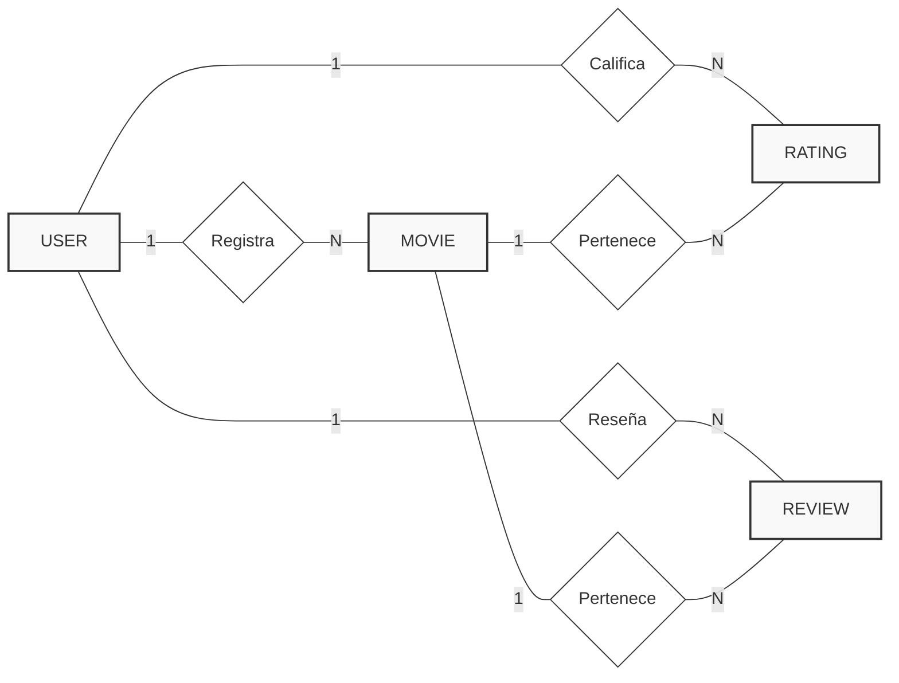

# PROYECTO LARAVEL
## Plataforma de Gestión Cultural con Laravel y MySQL

---

## 1. INTRODUCCIÓN DEL PROYECTO

### 1.1 Descripción General

Este proyecto didáctico tiene como objetivo el desarrollo completo de una aplicación web dinámica utilizando Laravel y MySQL, aplicando de forma práctica los contenidos trabajados en clase sobre desarrollo web con frameworks modernos de PHP.

A lo largo del proyecto se implementarán funcionalidades esenciales de una aplicación web profesional: **arquitectura MVC**, **sistema de autenticación con roles diferenciados**, **operaciones CRUD completas**, **sistema de clasificación y valoraciones**, **validación de formularios mediante Form Requests**, **gestión de archivos mediante Storage**, y uso de **migraciones y seeders** para la gestión de base de datos.

El alumnado deberá elegir **UNA** de las tres temáticas propuestas para desarrollar su plataforma de gestión cultural:

- **Opción 1:** Plataforma de gestión de películas
- **Opción 2:** Plataforma de gestión de música (álbumes/artistas)
- **Opción 3:** Plataforma de gestión de videojuegos

**Independientemente de la temática elegida**, todas deben cumplir con los **mismos requisitos técnicos y funcionalidades** establecidos en este documento. La elección de la temática es meramente estética, pero los componentes técnicos, la estructura del proyecto y las funcionalidades implementadas deben ser equivalentes.

Al finalizar el proyecto, se deberá entregar una **memoria técnica completa** que incluya: descripción detallada del desarrollo realizado, diagramas de base de datos (modelo entidad-relación y esquema de tablas), capturas de pantalla demostrativas de todas las funcionalidades, justificación de decisiones técnicas tomadas durante el desarrollo, y el enlace al repositorio de GitHub con el código fuente completo, correctamente documentado y con commits organizados.

---

### 1.2 Temáticas Disponibles (Elegir UNA)

#### Opción 1: Plataforma de Gestión de Películas

Una plataforma completa para cinéfilos donde los usuarios pueden:

- Registrar y catalogar películas con información detallada
- Añadir datos completos (título, director, año, género, duración, sinopsis, reparto)
- Subir pósters y material gráfico relacionado
- Clasificar películas mediante sistema de valoración por estrellas (1-5)
- Escribir y compartir reseñas detalladas
- Comentar en películas de otros usuarios
- Crear listas personalizadas de películas (vistas, pendientes, favoritas)
- Filtrar y buscar películas por múltiples criterios
- Panel administrativo para gestión completa del contenido

**Campos principales del modelo Movie:**
- Título, director, año de estreno, duración (minutos)
- Género (acción, drama, comedia, terror, ciencia ficción, etc.)
- Sinopsis, reparto principal, país de producción
- Póster (imagen), clasificación por edad
- Valoración media calculada automáticamente

---

#### Opción 2: Plataforma de Gestión de Música

Una plataforma para amantes de la música donde los usuarios pueden:

- Catalogar álbumes musicales y artistas
- Documentar información completa (título álbum, artista, año, género, discográfica)
- Subir portadas de álbumes y fotografías de artistas
- Valorar álbumes mediante sistema de puntuación (1-5 estrellas)
- Escribir y compartir reseñas musicales críticas
- Comentar en álbumes registrados por otros usuarios
- Crear colecciones personalizadas (escuchados, favoritos, wishlist)
- Buscar y filtrar por artista, género, año, etc.
- Panel de administración para gestionar todo el catálogo

**Campos principales del modelo Album:**
- Título del álbum, nombre del artista, año de lanzamiento
- Género musical (rock, pop, jazz, electrónica, clásica, etc.)
- Discográfica, número de pistas, duración total
- Portada del álbum (imagen), formato (vinilo, CD, digital)
- Valoración media calculada automáticamente

---

#### Opción 3: Plataforma de Gestión de Videojuegos

Una plataforma para gamers donde los usuarios pueden:

- Catalogar videojuegos de todas las plataformas
- Registrar información detallada (título, desarrolladora, plataforma, año, género)
- Subir carátulas, capturas de pantalla y material promocional
- Valorar juegos mediante sistema de puntuación (1-5 estrellas)
- Escribir análisis detallados y opiniones personales
- Comentar en los juegos catalogados por la comunidad
- Gestionar biblioteca personal (jugados, jugando, pendientes, completados)
- Filtrar por plataforma, género, año, desarrolladora
- Panel administrativo para gestión del catálogo completo

**Campos principales del modelo Game:**
- Título, desarrolladora, distribuidora, año de lanzamiento
- Plataforma (PC, PlayStation, Xbox, Nintendo, Mobile, etc.)
- Género (RPG, acción, estrategia, deportes, aventura, etc.)
- Sinopsis, modos de juego (individual, multijugador)
- Carátula (imagen), clasificación PEGI/ESRB
- Valoración media calculada automáticamente

---

### 1.3 Objetivos Generales de Aprendizaje

Al finalizar el proyecto, el alumnado será capaz de:

1. Desarrollar aplicaciones web completas utilizando el framework **Laravel**
2. Implementar correctamente la **arquitectura MVC** (Modelo-Vista-Controlador)
3. Diseñar e implementar **bases de datos relacionales** usando migraciones de Laravel
4. Gestionar **autenticación y autorización** con sistemas de roles (admin/usuario)
5. Implementar **operaciones CRUD completas** utilizando Eloquent ORM
6. Crear **sistemas de valoración y clasificación** con cálculos automáticos
7. Validar formularios mediante **Form Request Validation** de Laravel
8. Gestionar **subida y almacenamiento de archivos** usando Laravel Storage (Opcional)
9. Aplicar **medidas de seguridad web** (protección CSRF, validación, sanitización, autenticación)(Opcional)
10. Utilizar **Blade Templates** para crear vistas dinámicas y reutilizables
11. Trabajar con **seeders y factories** para generar datos de prueba
12. Implementar **relaciones Eloquent** (hasMany, belongsTo, belongsToMany)
13. Crear **middleware personalizado** para protección de rutas (Opcional)
14. Utilizar **Git** para control de versiones.

---

### 1.4 Tecnologías y Herramientas Utilizadas

**Backend:**
- Framework: Laravel 10.x o superior
- Lenguaje: PHP 8.1 o superior
- ORM: Eloquent
- Autenticación: Laravel Breeze o Laravel UI
- Validación: Form Request Classes

**Base de Datos:**
- Motor: MySQL 8.0 o MariaDB 10.5+
- Migraciones: Laravel Migrations
- Seeders: Laravel Seeders y Factories

**Frontend:**
- Motor de plantillas: Blade Templates
- Maquetación: HTML5, CSS3
- Framework CSS: Bootstrap 5 o Tailwind CSS
- JavaScript: Opcional para interactividad (Alpine.js o vanilla JS)

**Entorno de Desarrollo:**
- Servidor local: Laravel Valet, XAMPP, Laragon, WAMP o Docker con Laravel Sail, ect.
- Control de versiones: Git
- Plataforma: GitHub (repositorio público)
- Gestor de dependencias: Composer (PHP), NPM (Node.js)

**Herramientas de Laravel:**
- Artisan CLI: Comandos para generación de código
- Tinker: Shell interactivo para testing
- Storage: Sistema de archivos para imágenes
- Pagination: Sistema de paginación integrado

---

### 1.5 Metodología de Trabajo

El proyecto se desarrollará de forma **incremental y progresiva**, dividido en cinco fases principales:

**FASE 1:** Configuración y Estructura Base
- Instalación de Laravel y configuración del entorno
- Diseño de la base de datos
- Creación de migraciones iniciales
- Estructura de carpetas del proyecto

**FASE 2:** CRUD del Contenido Principal 
- Modelos Eloquent con relaciones
- Controladores con las 7 acciones REST
- Formularios de creación y edición
- Listados con paginación y búsqueda
- Gestión de imágenes 

**FASE 3:** Sistema de Autenticación y Gestión de Usuarios
- Implementación de registro y login
- Sistema de roles (Admin/Usuario)
- Middleware de autorización
- Perfiles de usuario

**FASE 4:** Sistema de Valoración y Comentarios
- Sistema de puntuación (estrellas)
- Cálculo automático de medias
- Sistema de comentarios/reseñas
- Prevención de valoraciones duplicadas

Cada fase construye sobre la anterior, permitiendo un desarrollo organizado, la comprensión gradual del framework Laravel.

---

### 1.6 Requisitos Funcionales Obligatorios

Independientemente de la temática elegida (Películas, Música o Videojuegos), **TODAS** las plataformas DEBEN incluir obligatoriamente:

#### RF-01: Sistema de Usuarios con Roles Diferenciados
- Registro de nuevos usuarios con validación completa
- Login y logout con gestión de sesiones
- Dos roles claramente diferenciados:
  - **ROL USER**: Acceso a funcionalidades básicas (crear, editar propio contenido, valorar, comentar)
  - **ROL ADMIN**: Acceso total (gestión de todo el contenido, gestión de usuarios, panel administrativo)
- Protección de rutas mediante middleware según rol
- Un usuario administrador creado mediante seeder

#### RF-02: CRUD Completo del Contenido Principal
- **CREATE**: Formulario para crear nuevo contenido (película/álbum/juego) - Solo usuarios autenticados
- **READ**: 
  - Listado general de todo el contenido (acceso público con paginación)
  - Página de detalle individual (acceso público)
- **UPDATE**: Editar contenido existente - Solo el creador o administrador
- **DELETE**: Eliminar contenido - Solo el creador o administrador con confirmación
- Todas las operaciones deben usar Eloquent ORM
- Validación completa en todas las operaciones mediante Form Requests

#### RF-03: Sistema de Clasificación/Valoración con Estrellas
- Sistema de puntuación de 1 a 5 estrellas
- Cada usuario puede valorar una vez cada ítem
- Cálculo automático del promedio de valoraciones
- Mostrar promedio visual (estrellas) y numérico
- Prevención de valoraciones duplicadas mediante constraint unique en BD
- Posibilidad de modificar la propia valoración

#### RF-04: Gestión de Imágenes
- Subida de imágenes (póster/portada/carátula) al crear/editar contenido
- Validación de tipo de archivo (jpg, jpeg, png, gif)
- Validación de tamaño máximo (2MB)
- Almacenamiento organizado usando Laravel Storage
- Imagen por defecto si no se sube ninguna
- Eliminación de imagen antigua al actualizar
- Visualización correcta en todas las vistas

#### RF-05: Sistema de Comentarios/Reseñas
- Añadir comentarios/reseñas al contenido (solo usuarios autenticados)
- Visualizar todos los comentarios con información del autor y fecha
- Editar propios comentarios (opcional)
- Eliminar propios comentarios
- Los administradores pueden eliminar cualquier comentario
- Orden cronológico (más recientes primero)

#### RF-06: Panel de Administración (opcional)
- Vista exclusiva para usuarios con rol ADMIN
- Dashboard con estadísticas generales:
  - Total de contenido registrado
  - Total de usuarios registrados
  - Total de valoraciones realizadas
  - Contenido mejor valorado
  - Actividad reciente
- Listado completo de todo el contenido con opciones de editar/eliminar
- Listado de todos los usuarios (con opción de cambiar rol o eliminar)
- Acceso protegido mediante middleware

#### RF-07: Búsqueda y Filtrado (opcional)
- Buscador por nombre/título
- Filtros por:
  - Género/categoría
  - Año
  - Valoración mínima
- Ordenamiento por:
  - Más recientes
  - Mejor valorados
  - Orden alfabético
- Combinación de múltiples filtros

#### RF-08: Seguridad y Validación (opcional)
- Protección CSRF en todos los formularios
- Validación server-side de todos los datos mediante Form Requests
- Sanitización de entradas de usuario
- Hash de contraseñas con bcrypt
- Protección de rutas sensibles con middleware auth y role
- Mensajes de error amigables y específicos
- Prevención de SQL injection mediante Eloquent

---

### 1.7 Estructura de Base de Datos Requerida

Todas las plataformas deben implementar las siguientes tablas (adaptando nombres según temática):

#### Tablas Obligatorias:

1. **users** (viene con Laravel, añadir campo `role`)
   - Usuarios del sistema con roles

2. **[contenido_principal]** (movies/albums/games)
   - Contenido principal de la plataforma
   - Relación 1:N con users (un usuario crea muchos ítems)

3. **ratings** (valoraciones)
   - Valoraciones de 1-5 estrellas
   - Relación N:1 con users (muchas valoraciones de un usuario)
   - Relación N:1 con contenido (muchas valoraciones a un ítem)
   - Constraint UNIQUE (user_id, content_id) para evitar duplicados

4. **reviews** o **comments** (comentarios/reseñas)
   - Comentarios sobre el contenido
   - Relación N:1 con users
   - Relación N:1 con contenido

#### Tablas Opcionales (para nota extra):

5. **genres** o **categories** (géneros/categorías)
   - Catálogo de géneros
   - Relación N:M con contenido

6. **user_lists** o **favorites** (listas personales)
   - Listas personalizadas de usuarios
   - Relación N:M entre users y contenido

---

### 1.8 Diagrama Entidad-Relación (Ejemplo para Peliculas)

**Relaciones clave:**
- Users 1:N Movies (un usuario crea muchas películas)
- Users 1:N Ratings (un usuario hace muchas valoraciones)
- Movies 1:N Ratings (una película tiene muchas valoraciones)
- Users 1:N Reviews (un usuario escribe muchas reseñas)
- Movies 1:N Reviews (una película tiene muchas reseñas)

**Nota**: Para MusicHub cambiar "movies" por "albums", para GameTracker cambiar por "games". La estructura es idéntica.

---

### 1.9 Resultados Esperados

Al finalizar el proyecto, se dispondrá de una aplicación web completamente funcional con:

Arquitectura MVC correctamente implementada siguiendo convenciones de Laravel  
Base de datos relacional normalizada con todas las relaciones necesarias  
Sistema completo de autenticación con roles diferenciados (User/Admin)  
CRUD funcional del contenido principal con todas las validaciones  
Sistema de valoraciones operativo con cálculo automático de promedios  
Gestión completa de imágenes con validación y almacenamiento seguro  
Sistema de comentarios/reseñas asociado al contenido  
Panel administrativo funcional con estadísticas  
Búsqueda y filtrado de contenido por múltiples criterios  
Validaciones robustas del lado del servidor mediante Form Requests  
Interfaz responsive y funcional usando Bootstrap o Tailwind  
Código limpio, bien documentado y siguiendo estándares PSR  
Repositorio Git con historial de commits organizado  
Documentación técnica completa del proyecto  

---

## 2. ACTIVIDADES POR FASES

### FASE 1: CONFIGURACIÓN INICIAL Y ESTRUCTURA DEL PROYECTO

#### Actividad 1.1: Instalación y Configuración de Laravel
**Objetivo:** Instalar Laravel y configurar el entorno de desarrollo

**Tareas a realizar:**
1. Verificar requisitos del sistema (PHP 8.1+, Composer, MySQL)
2. Crear nuevo proyecto Laravel mediante Composer
3. Configurar archivo `.env` con credenciales de base de datos
4. Crear base de datos vacía en MySQL
5. Generar clave de aplicación
6. Iniciar servidor de desarrollo
7. Verificar funcionamiento

---

#### Actividad 1.2: Configuración de Git y GitHub
**Objetivo:** Inicializar control de versiones

**Tareas a realizar:**
1. Inicializar repositorio Git local
2. Revisar archivo `.gitignore`
3. Crear repositorio público en GitHub
4. Conectar repositorio local con remoto
5. Realizar primer commit
6. Subir cambios a GitHub

---

#### Actividad 1.3: Diseño del Modelo Entidad-Relación
**Objetivo:** Diseñar la estructura de base de datos

**Tareas a realizar:**
1. Identificar entidades principales según temática elegida
2. Definir atributos de cada entidad
3. Establecer relaciones entre entidades
4. Especificar cardinalidades
5. Identificar claves primarias y foráneas
6. Crear diagrama ER completo

---

#### Actividad 1.4: Creación de Migración para Users
**Objetivo:** Modificar migración de users añadiendo campo role

**Tareas a realizar:**
1. Localizar migración de users
2. Añadir campo `role` tipo ENUM('user', 'admin')
3. Establecer valor por defecto 'user'
4. Verificar método down()

---

#### Actividad 1.5: Creación de Migración del Contenido Principal
**Objetivo:** Crear migración de tabla principal (movies/albums/games)

**Tareas a realizar:**
1. Crear nueva migración con Artisan
2. Definir todos los campos requeridos según temática
3. Establecer clave foránea con users
4. Configurar eliminación en cascada
5. Implementar método down()

---

#### Actividad 1.6: Creación de Migración para Ratings
**Objetivo:** Crear tabla de valoraciones con restricción unique

**Tareas a realizar:**
1. Crear migración para ratings
2. Definir claves foráneas (user_id, content_id)
3. Añadir campo score (1-5)
4. Implementar restricción UNIQUE compuesta
5. Configurar cascadas

---

#### Actividad 1.7: Creación de Migración para Reviews
**Objetivo:** Crear tabla de comentarios/reseñas

**Tareas a realizar:**
1. Crear migración para reviews
2. Definir claves foráneas
3. Añadir campos title (opcional) y content
4. Decidir si permitir múltiples reseñas por usuario
5. Configurar cascadas

---

#### Actividad 1.8: Ejecución y Verificación de Migraciones
**Objetivo:** Ejecutar migraciones y verificar estructura de BD

**Tareas a realizar:**
1. Verificar todas las migraciones creadas
2. Ejecutar `php artisan migrate`
3. Verificar tablas en phpMyAdmin/MySQL Workbench
4. Comprobar claves foráneas
5. Probar rollback y re-migración

---

#### Actividad 1.9: Documentación de Estructura de BD
**Objetivo:** Crear documentación técnica de la base de datos

**Tareas a realizar:**
1. Incluir diagrama ER actualizado
2. Describir cada tabla detalladamente
3. Crear diccionario de datos
4. Documentar todas las relaciones
5. Justificar decisiones de diseño

---

### FASE 2: CRUD DEL CONTENIDO PRINCIPAL

#### Actividad 2.1: Creación del Modelo Eloquent
**Objetivo:** Crear modelo del contenido principal con relaciones

**Tareas a realizar:**
1. Crear modelo con Artisan (Movie/Album/Game)
2. Definir $fillable
3. Implementar relación belongsTo con User
4. Implementar relación hasMany con Ratings
5. Implementar relación hasMany con Reviews
6. Crear método updateAverageRating()

---

#### Actividad 2.2: Creación de Resource Controller
**Objetivo:** Crear controlador con 7 acciones REST

**Tareas a realizar:**
1. Crear controlador resource con Artisan
2. Implementar método index() - listado
3. Implementar método create() - formulario creación
4. Implementar método store() - guardar nuevo
5. Implementar método show() - ver detalle
6. Implementar método edit() - formulario edición
7. Implementar método update() - actualizar
8. Implementar método destroy() - eliminar

---

#### Actividad 2.3: Creación de Form Requests
**Objetivo:** Implementar validación mediante Form Requests

**Tareas a realizar:**
1. Crear StoreRequest para creación
2. Crear UpdateRequest para actualización
3. Definir reglas de validación
4. Personalizar mensajes de error en español
5. Implementar método authorize()
6. Integrar en controlador

---

#### Actividad 2.4: Vista Index (Listado)
**Objetivo:** Crear vista de listado con paginación

**Tareas a realizar:**
1. Crear vista index.blade.php
2. Implementar paginación (15 ítems por página)
3. Mostrar tarjetas con imagen, título y rating
4. Añadir botón "Ver más"
5. Implementar mensaje si no hay contenido
6. Añadir enlace "Crear nuevo" (solo autenticados)

#### Actividad 2.5: Vista Create (Formulario de Creación)
**Objetivo:** Crear formulario para añadir nuevo contenido

**Tareas a realizar:**
1. Crear vista create.blade.php
2. Implementar formulario con todos los campos
3. Añadir protección CSRF
4. Implementar campo de subida de imagen
5. Mostrar errores de validación
6. Aplicar estilos Bootstrap/Tailwind

---

#### Actividad 2.6: Vista Show (Detalle)
**Objetivo:** Crear vista de detalle del contenido

**Tareas a realizar:**
1. Crear vista show.blade.php
2. Mostrar toda la información del ítem
3. Mostrar imagen destacada
4. Mostrar valoración promedio
5. Mostrar botones editar/eliminar (solo creador o admin)
6. Incluir sección de valoraciones
7. Incluir sección de comentarios

---

#### Actividad 2.7: Vista Edit (Formulario de Edición)
**Objetivo:** Crear formulario de edición

**Tareas a realizar:**
1. Crear vista edit.blade.php
2. Pre-rellenar formulario con datos existentes
3. Permitir cambio de imagen (opcional)
4. Implementar validación
5. Verificar autorización (solo creador o admin)

---

#### Actividad 2.8: Gestión de Imágenes con Storage (Opcional)
**Objetivo:** Implementar subida y almacenamiento de imágenes

**Tareas a realizar:**
1. Configurar Storage en filesystem.php
2. Crear enlace simbólico (php artisan storage:link)
3. Implementar lógica de subida en store()
4. Implementar lógica de actualización en update()
5. Implementar eliminación de imagen antigua
6. Validar tipo y tamaño de archivo
7. Asignar imagen por defecto si no se sube

---

#### Actividad 3.9: Implementación de Búsqueda y Filtros (Opcional)
**Objetivo:** Añadir funcionalidad de búsqueda y filtrado

**Tareas a realizar:**
1. Crear formulario de búsqueda en index
2. Implementar búsqueda por título/nombre
3. Añadir filtro por género
4. Añadir filtro por año
5. Añadir filtro por valoración mínima
6. Implementar ordenamiento (recientes, mejor valorados, alfabético)
7. Combinar múltiples filtros

---

#### Actividad 3.10: Seeders y Factories para Contenido 
**Objetivo:** Generar datos de prueba del contenido

**Tareas a realizar:**
1. Crear Factory para el modelo principal
2. Definir datos falsos apropiados según temática
3. Crear Seeder para contenido
4. Generar al menos 20 ítems de prueba (podéis ayudaros de la IA o de webscraping)
5. Asignar usuarios aleatorios como creadores
6. Ejecutar seeders

---

### FASE 3: SISTEMA DE AUTENTICACIÓN Y GESTIÓN DE USUARIOS

#### Actividad 3.1: Instalación de Laravel Breeze
**Objetivo:** Instalar sistema de autenticación básico

**Tareas a realizar:**
1. Instalar Laravel Breeze con Composer
2. Ejecutar instalación de Breeze
3. Instalar dependencias NPM
4. Compilar assets
5. Ejecutar migraciones de Breeze
6. Probar registro y login

---

#### Actividad 3.2: Personalización de Vistas de Autenticación
**Objetivo:** Adaptar vistas a la temática del proyecto

**Tareas a realizar:**
1. Personalizar vista de login
2. Personalizar vista de registro
3. Actualizar layouts (app.blade.php y guest.blade.php)
4. Añadir branding del proyecto
5. Aplicar colores temáticos
6. Traducir mensajes a español
7. Verificar responsive design

---

#### Actividad 3.3: Configuración del Modelo User
**Objetivo:** Configurar relaciones y métodos helper

**Tareas a realizar:**
1. Añadir 'role' a $fillable
2. Definir relación hasMany con contenido
3. Definir relación hasMany con ratings
4. Definir relación hasMany con reviews
5. Implementar método isAdmin()
6. Implementar método isUser()

---

#### Actividad 3.4: Creación de Middleware IsAdmin
**Objetivo:** Crear middleware para proteger rutas de admin

**Tareas a realizar:**
1. Crear middleware con Artisan
2. Implementar lógica de verificación
3. Registrar middleware en Kernel.php
4. Probar en ruta de prueba
5. Verificar redirección apropiada

---

#### Actividad 3.5: Creación de Seeders para Usuarios
**Objetivo:** Generar usuarios de prueba

**Tareas a realizar:**
1. Crear UserSeeder con Artisan
2. Implementar creación de admin (email: admin@admin.com, password: password)
3. Crear al menos 3 usuarios normales
4. Registrar seeder en DatabaseSeeder
5. Ejecutar seeders

---

#### Actividad 3.6: Creación de Vistas de Perfil
**Objetivo:** Crear página de perfil de usuario

**Tareas a realizar:**
1. Crear ruta para perfil
2. Crear controlador ProfileController
3. Crear vista de perfil
4. Mostrar información del usuario
5. Mostrar contenido creado por el usuario
6. Añadir enlace en navbar

---
### FASE 4: SISTEMA DE VALORACIÓN Y COMENTARIOS

#### Actividad 4.1: Creación del Modelo Rating
**Objetivo:** Crear modelo de valoraciones con relaciones

**Tareas a realizar:**
1. Crear modelo Rating con Artisan
2. Definir $fillable (user_id, content_id, score)
3. Implementar relación belongsTo con User
4. Implementar relación belongsTo con contenido (Movie/Album/Game)
5. Añadir validación de score (1-5)

---

#### Actividad 4.2: Creación del Controlador de Ratings
**Objetivo:** Implementar lógica para valorar contenido

**Tareas a realizar:**
1. Crear RatingController
2. Implementar método store() para crear/actualizar valoración
3. Verificar que el usuario esté autenticado
4. Verificar si ya existe valoración del usuario
5. Si existe: actualizar, si no: crear nueva
6. Recalcular promedio del contenido
7. Retornar respuesta JSON o redirección

---

#### Actividad 4.3: Implementación de Cálculo de Promedio
**Objetivo:** Automatizar cálculo de valoración media

**Tareas a realizar:**
1. Implementar método updateAverageRating() en modelo principal
2. Calcular promedio usando avg() de Eloquent
3. Actualizar campo average_rating del contenido
4. Llamar al método después de cada valoración
5. Redondear a 2 decimales

---

#### Actividad 4.4: Vista de Sistema de Estrellas
**Objetivo:** Crear interfaz visual para valoraciones

**Tareas a realizar:**
1. Crear componente de estrellas con CSS/Bootstrap
2. Implementar estrellas clicables para valorar
3. Mostrar valoración actual del usuario
4. Mostrar promedio general
5. Mostrar número total de valoraciones
6. Añadir feedback visual al valorar
7. Integrar en vista show del contenido

---

#### Actividad 4.5: Prevención de Valoraciones Duplicadas
**Objetivo:** Implementar control de valoraciones únicas

**Tareas a realizar:**
1. Verificar restricción UNIQUE en migración de ratings
2. Implementar lógica en controlador para detectar valoración existente
3. Permitir actualizar valoración propia
4. Mostrar mensaje si ya valoró
5. Manejar excepciones de duplicados
6. Implementar try-catch para errores de BD

---

#### Actividad 4.6: Creación del Modelo Review
**Objetivo:** Crear modelo de comentarios/reseñas

**Tareas a realizar:**
1. Crear modelo Review con Artisan
2. Definir $fillable (user_id, content_id, title, content)
3. Implementar relación belongsTo con User
4. Implementar relación belongsTo con contenido
5. Configurar ordenamiento por fecha (más recientes primero)

---

#### Actividad 4.7: Creación del Controlador de Reviews
**Objetivo:** Implementar CRUD de comentarios

**Tareas a realizar:**
1. Crear ReviewController
2. Implementar método store() para crear comentario
3. Implementar método update() para editar propio comentario
4. Implementar método destroy() para eliminar
5. Verificar autorización (solo creador o admin puede editar/eliminar)
6. Validar campos requeridos
7. Asociar automáticamente usuario autenticado

---

#### Actividad 4.8: Form Request para Reviews
**Objetivo:** Crear validación para comentarios

**Tareas a realizar:**
1. Crear StoreReviewRequest
2. Definir reglas de validación:
   - content: required, min:10, max:1000
   - title: nullable, max:100
3. Personalizar mensajes en español
4. Implementar método authorize()
5. Integrar en controlador

---

#### Actividad 4.9: Vista de Comentarios en Detalle 
**Objetivo:** Mostrar comentarios en página de detalle

**Tareas a realizar:**
1. Añadir sección de comentarios en show.blade.php
2. Listar todos los comentarios del ítem
3. Mostrar información del autor y fecha
4. Implementar formulario para nuevo comentario (solo autenticados)
5. Añadir botones editar/eliminar (solo creador o admin)
6. Mostrar mensaje si no hay comentarios
7. Aplicar estilos apropiados

---

#### Actividad 4.10: Edición y Eliminación de Comentarios (Opcional)
**Objetivo:** Permitir gestión de propios comentarios

**Tareas a realizar:**
1. Crear vista de edición de comentario (opcional: modal o página)
2. Implementar formulario de edición
3. Verificar autorización
4. Implementar confirmación de eliminación (JavaScript)
5. Mostrar mensajes de éxito/error
6. Redireccionar apropiadamente

---

#### Actividad 4.11: Estadísticas de Valoraciones (Opcional)
**Objetivo:** Mostrar distribución de valoraciones

**Tareas a realizar:**
1. Calcular cantidad de valoraciones por puntuación (1-5)
2. Crear vista de estadísticas con barras
3. Mostrar porcentajes
4. Integrar en vista show del contenido
5. Aplicar estilos visuales

---

#### Actividad 4.12: Factory y Seeder para Ratings y Reviews
**Objetivo:** Generar datos de prueba de valoraciones y comentarios

**Tareas a realizar:**
1. Crear Factory para Rating
2. Crear Factory para Review
3. Crear Seeders respectivos
4. Generar valoraciones aleatorias (evitando duplicados)
5. Generar comentarios con texto realista
6. Asignar usuarios aleatorios
7. Ejecutar seeders y verificar promedios

---
## 3. CRITERIOS DE EVALUACIÓN GLOBAL

### Evaluación por Fases

| Fase | Peso | Aspectos Evaluados |
|------|------|-------------------|
| **Fase 1** | 25% | Configuración, migraciones, diseño BD, documentación inicial |
| **Fase 2** | 25% | Autenticación, roles, middleware, seeders de usuarios |
| **Fase 3** | 25% | CRUD completo, gestión imágenes, búsqueda, validación |
| **Fase 4** | 25% | Sistema de valoración, comentarios, prevención duplicados |

### Requisitos Mínimos para Aprobar

- Laravel instalado y funcionando
- Base de datos con todas las tablas
- Autenticación completa (registro/login)
- CRUD básico funcionando
- Sistema de roles implementado
- Al menos sistema de valoración O comentarios

## 4. RECURSOS Y DOCUMENTACIÓN DE APOYO

### Documentación Oficial de Laravel
- **Instalación**: https://laravel.com/docs/10.x/installation
- **Migraciones**: https://laravel.com/docs/10.x/migrations
- **Eloquent ORM**: https://laravel.com/docs/10.x/eloquent
- **Validación**: https://laravel.com/docs/10.x/validation
- **Autenticación**: https://laravel.com/docs/10.x/authentication
- **Storage**: https://laravel.com/docs/10.x/filesystem
- **Blade Templates**: https://laravel.com/docs/10.x/blade

### Tutoriales Recomendados
- **Laracasts** (inglés): https://laracasts.com
- **Coders Free** (español): https://www.youtube.com/@CodersFree
- **Rimorsoft** (español): https://www.youtube.com/@Rimorsoft
- **Laravel Daily** (inglés): https://www.youtube.com/@LaravelDaily

### Herramientas Útiles
- **Laravel.io**: Comunidad y soporte
- **Stack Overflow**: Resolución de problemas específicos
- **GitHub**: Ejemplos de proyectos similares
- **TablePlus/DBeaver**: Gestión de base de datos
- **Postman**: Testing de APIs (opcional)

### Recursos de Diseño
- **Bootstrap 5**: https://getbootstrap.com
- **Tailwind CSS**: https://tailwindcss.com
- **FontAwesome**: https://fontawesome.com (iconos)
- **Unsplash**: https://unsplash.com (imágenes libres)
